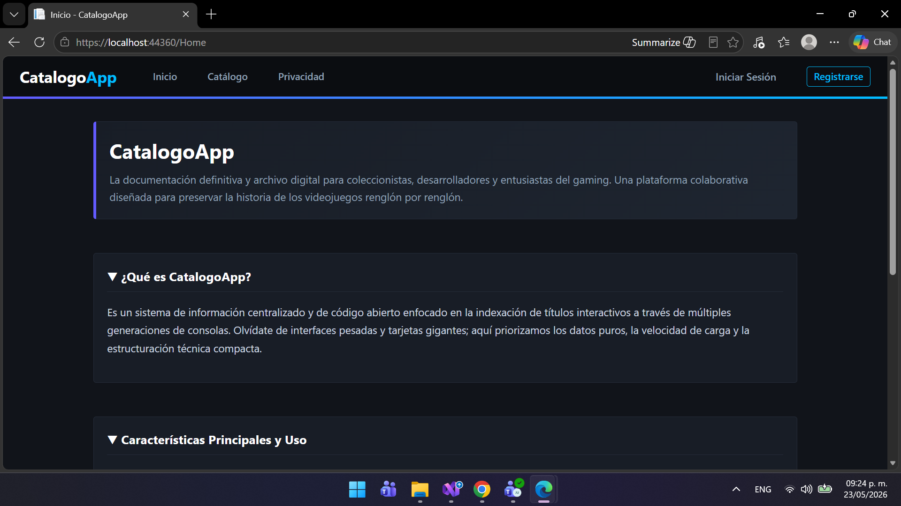
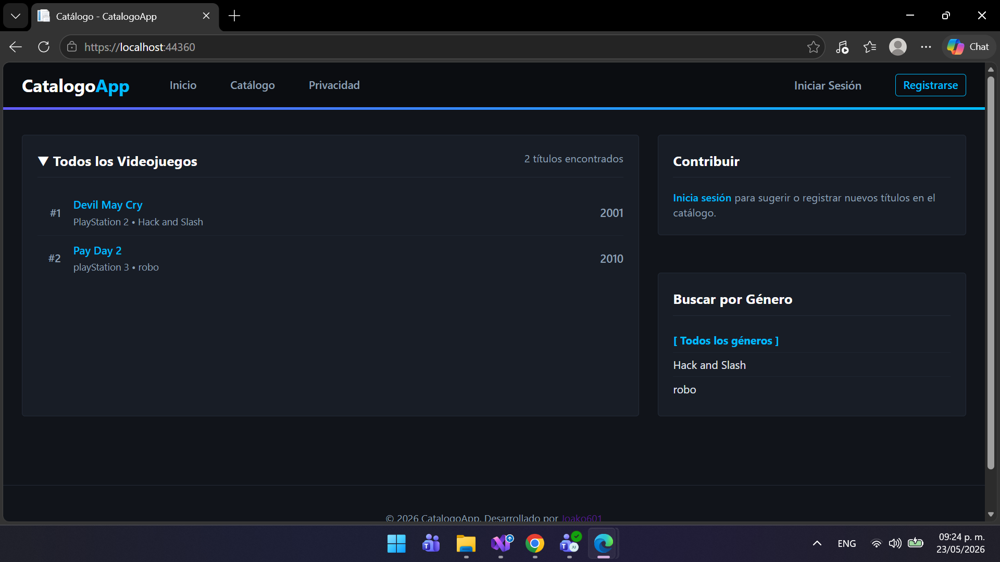
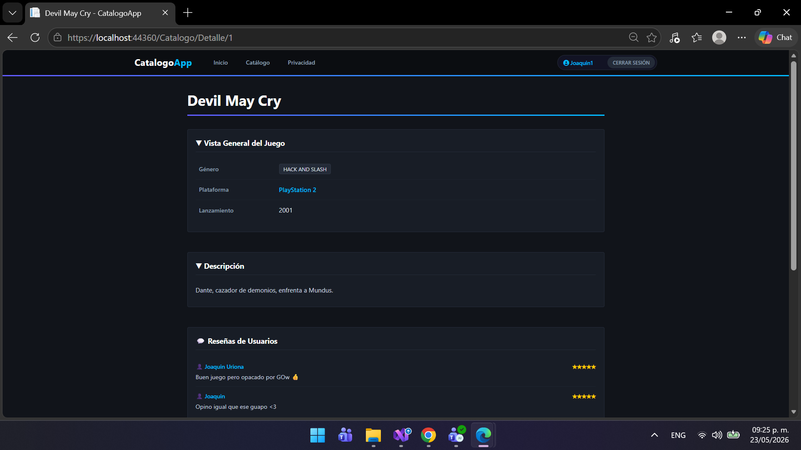
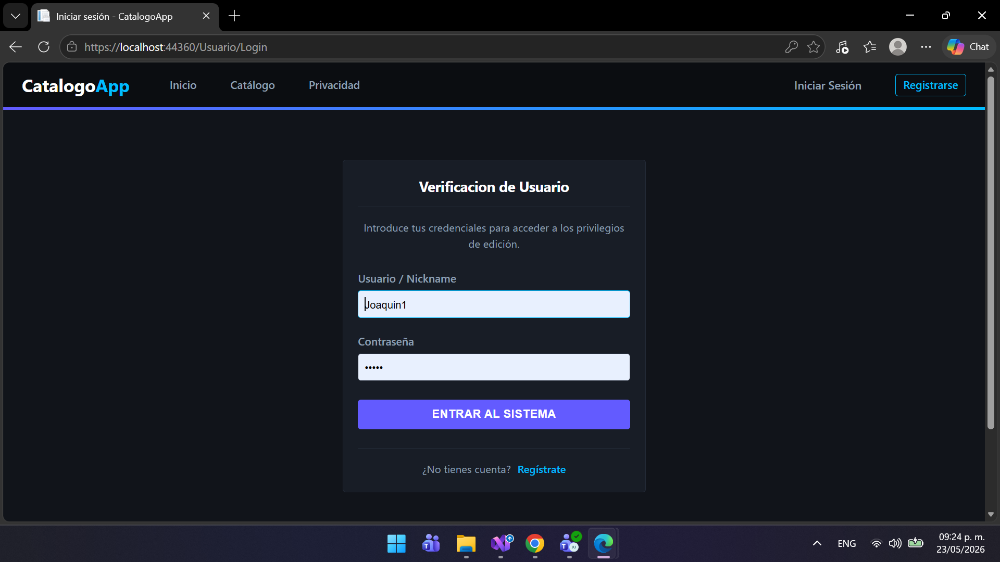
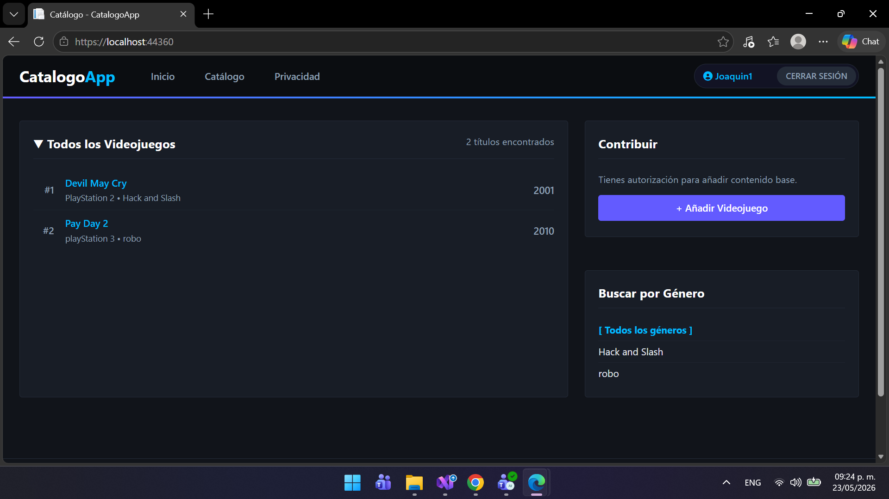

# 📘 Arquitectura de Software - Práctica 3

## 👨‍💻 Información del Estudiante

- **Nombre:** Joaquin Uriona
- **Matrícula:** SW2509057
- **Grupo:** A
- **Cuatrimestre:** Tercer Cuatrimestre
- **Carrera:** TSU en Desarrollo e Innovación de Software
- **Profesor:** Jorge Javier Pedrozo Romero
---

## 📋 Descripción del Proyecto

Este repositorio contiene el desarrollo de **CatalogoApp**, una plataforma colaborativa y enciclopedia digital diseñada bajo principios de arquitectura desacoplada para la indexación técnica de videojuegos, gestión de sesiones de usuario y módulos de reseñas en tiempo real. 

Inspirado en la densidad de datos de plataformas clásicas, el sistema prioriza la velocidad de carga, la transparencia de datos y una interfaz limpia totalmente adaptada al modo oscuro, eliminando el uso de frameworks visuales genéricos en favor de una estética inmersiva personalizada.
---

## 🧩 Arquitectura del Módulo

* **CatalogoApp.Domain (Capa de Dominio):** El núcleo del sistema. Contiene las entidades principales independientes (`Item`, `Usuario`, `Resena`) y los contratos esenciales sin dependencias de librerías externas o frameworks.
* **CatalogoApp.Application (Capa de Aplicación):** Orquesta los flujos de datos y contiene la lógica transaccional mediante servicios especializados como `ItemService`.
* **CatalogoApp.Infrastructure (Capa de Infraestructura):** Implementa el almacenamiento persistente mediante `JsonResenaRepository` y repositorios de ítems. Realiza la lectura/escritura atómica sobre bases de datos de archivos planos estructurados en formato JSON.
* **CatalogoApp.Presentation (Capa de Presentación):** Desarrollada en **ASP.NET Core MVC**. Gestiona las solicitudes del cliente mediante controladores dedicados (`CatalogoController`, `UsuarioController`, `ResenaController`), control de sesiones seguro mediante `HttpContext.Session` y renderizado de vistas dinámicas con Razor (.cshtml).
---

## 📸 Módulos e Interfaz del Sistema (Galería de Capturas)

A continuación se presenta una secuencia visual de las 5 interfaces principales que componen el ecosistema de la aplicación:

### 1. Portada de Inicio (Home)
<div align="center">
  
  <br />
  <sub><i>Interfaz de bienvenida de CatalogoApp. Presenta de forma limpia los objetivos del sistema y centraliza los accesos del menú superior en español.</i></sub>
</div>

### 2. Catálogo General de Videojuegos
<div align="center">
  
  <br />
  <sub><i>Muestra la biblioteca de títulos indexados en orden numérico con filtros laterales dinámicos organizados por género y control de acceso para contribuciones.</i></sub>
</div>

### 3. Ficha Técnica y Módulo Transaccional de Reseñas
<div align="center">
  
  <br />
  <sub><i>Vista detallada expandida de un juego. Muestra la sinopsis, especificaciones de la plataforma y el panel dinámico para la publicación y lectura de críticas por usuarios autenticados.</i></sub>
</div>

### 4. Interfaz Unificada de Autenticación (Login)
<div align="center">
  
  <br />
  <sub><i>Formulario oscuro centrado para el inicio de sesión seguro, mapeado nativamente con el controlador de usuarios.</i></sub>
</div>

### 5. Catalogo visto desde un usuario activo
<div align="center">
  
  <br />
  <sub><i>
    Perspectiva con sesión iniciada. El sistema reconoce los privilegios del perfil activo, habilitando el botón avanzado de contribución para inyectar nuevos títulos y mostrando el estado de autenticación dinámico en el encabezado.
  </i></sub>
</div>

---

## 📁 Estructura del Proyecto

```
CatalogoApp/
├─ CatalogoApp.Domain/
│  ├─ Models/
│  │  ├─ Item.cs
│  │  ├─ Usuario.cs
│  │  ├─ Resena.cs
│  │  └─ ErrorViewModel.cs
│  └─ Interfaces/
│     └─ IItemRepository.cs
│
├─ CatalogoApp.Application/
│  └─ Services/
│     └─ ItemService.cs
│
├─ CatalogoApp.Infrastructure/
│  └─ Repositories/
│     ├─ JsonItemRepository.cs
│     ├─ JsonUsuarioRepository.cs
│     └─ JsonResenaRepository.cs
│
└─ CatalogoApp.Presentation/
   ├─ Controllers/
   │  ├─ CatalogoController.cs
   │  ├─ UsuarioController.cs
   │  └─ ResenaController.cs
   ├─ Views/
   │  ├─ Catalogo/
   │  │  ├─ Index.cshtml
   │  │  ├─ Detalle.cshtml
   │  │  └─ Agregar.cshtml
   ├─ Usuario/
   │  ├─ Login.cshtml
   │  └─ Registro.cshtml
   ├─ Data/
   │  ├─ items.json
   │  ├─ usuarios.json
   │  └─ resenas.json
   └─ Program.cs
```

---

### 🛠️ Tecnologías Utilizadas
* **Lenguaje:** C# (.NET Core)
* **Patrón Arquitectónico:** Model-View-Controller (MVC) y Principios SOLID
* **Persistencia:** Archivos planos locales estructurados en formato JSON
* **Frontend Web:** Razor Pages, CSS3 Personalizado

---


## 🤝 Agradecimientos

- **Profesor Jorge Javier Pedrozo Romero** por la estructura del curso y la práctica
- **Tecnológico de Software** por la formación integral

---

## 📧 Contacto

- **Email Institucional:** joaquin.uriona@tecdesoftware.edu.mx
- **GitHub:** [Joako601](https://github.com/TU-USUARIO)

---

## 📄 Licencia

Este proyecto fue desarrollado por **Joaquin Uriona** como parte de las prácticas académicas para el **Tecnológico de Software**. 

Distribuido bajo la Licencia MIT. Siéntete libre de utilizar la arquitectura del código y el diseño de la interfaz para fines educativos o proyectos personales, siempre y cuando se mantenga el reconocimiento al autor original. 

Consulta el archivo `LICENSE` para más detalles.

---

## 🤖 Declaración de Uso de IA

Este proyecto integra asistencia de Inteligencia Artificial **exclusivamente para la correccion de la identacion** y **exclusivamente para la optimización de los componentes visuales de la interfaz en las vistas Razor**

---

<div align="center">

**⭐ Si te gustó este proyecto, dale una estrella ⭐**

Hecho con 💙 por Joaquin Uriona - 2026

</div>
